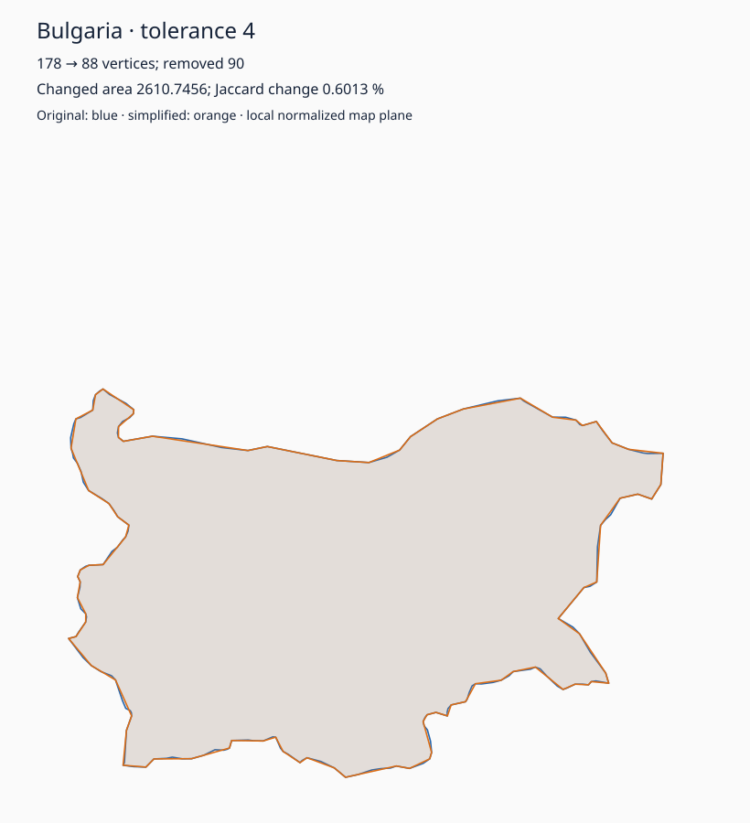
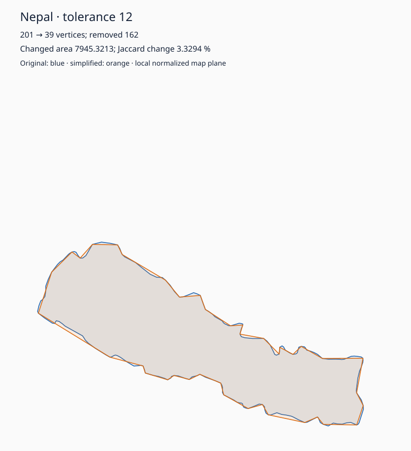
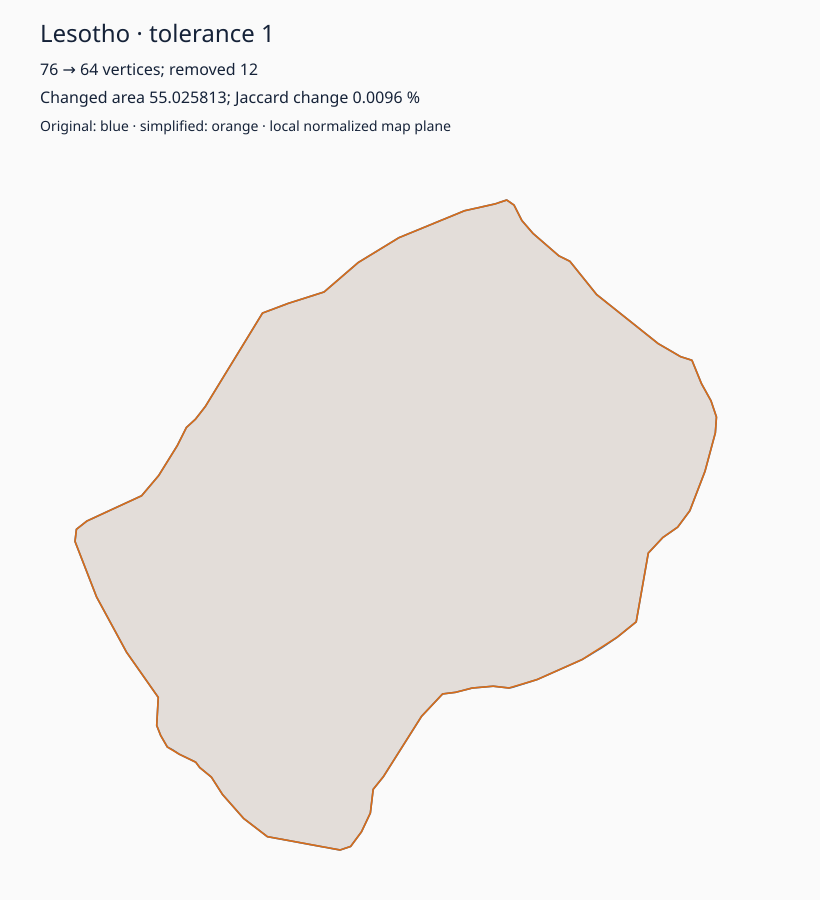

# Filled-area change after contour simplification

This example asks how much filled region changes when a closed contour is simplified.
It uses `WindingArea.FilledRegions(original, simplified)` to obtain XOR area and
`JaccardDistance = XOR / union`. A smaller Jaccard change means less filled area changed;
it is not a similarity probability or a bound on the largest local displacement.

The [measured results](RESULTS.md) retain all twelve pairs, numerical disagreements,
three-process timing ranges and allocations for both implementations.

```csharp
var change = WindingArea.FilledRegions(original, simplified);
Console.WriteLine($"Changed area: {change.SymmetricDifferenceArea}");
Console.WriteLine($"Union-normalized change: {change.JaccardDistance}");
```

The simplifier and clipping comparison are **example-only** uses of the already pinned
Clipper2 2.0.0 package. The example references `PolylineKit.Winding`, whose runtime has
no Clipper dependency. No new simplification algorithm or general SVG/GIS parser is added.

From the repository root:

```powershell
dotnet restore examples/AreaChange/AreaChange.csproj --locked-mode
dotnet run --project examples/AreaChange -c Release -- check
dotnet run --project examples/AreaChange -c Release -- run examples/AreaChange/artifacts
$env:DOTNET_TieredCompilation = '0'
1..3 | ForEach-Object {
    dotnet run --project examples/AreaChange -c Release --no-build -- benchmark examples/AreaChange/artifacts $_ (git rev-parse HEAD)
}
dotnet run --project examples/AreaChange -c Release --no-build -- summarize examples/AreaChange/artifacts
```

`check` performs analytic checks and real-pair comparison without recording time.
`run` writes the actual original/simplified pairs, numerical results, and twelve SVG
overlays. `benchmark` records one independent process with five batches per method;
`summarize` validates matching process identities and writes a readable report. Run
benchmarks on an otherwise idle machine. A revision argument identifies the source;
when measuring an uncommitted change, label it explicitly rather than claiming clean HEAD.
The summarizer also checks its currently loaded assemblies and input-pair hash against
the measured versions before regenerating accuracy tables and overlays.

## Frozen inputs and license

The four complete single-ring features are Bulgaria (178 vertices), Switzerland (186),
Lesotho (76), and Nepal (201), from Natural Earth's 1:50m Admin 0 Countries at v5.1.2.
The source geometries are all `Polygon` with exactly one ring. No islands or holes were
discarded, and no contours were joined by invented bridges. A repeated closing point
was removed because this API closes paths implicitly.

Natural Earth data is **public domain**, as stated in its
[official terms](https://www.naturalearthdata.com/about/terms-of-use/).
Made with Natural Earth. The pinned
[original dataset](https://github.com/nvkelso/natural-earth-vector/blob/v5.1.2/geojson/ne_50m_admin_0_countries.geojson),
full-source SHA-256, frozen-file hashes, and extraction rules are recorded in
[data/manifest.json](data/manifest.json). Every run verifies the frozen file hashes.
The dataset notice applies to the geographic data; the example's source code follows
the repository MIT license.

[data/freeze.py](data/freeze.py) reproduces the files using Python's standard library.
It accepts the original GeoJSON as an optional argument; otherwise it downloads the
pinned source and verifies its hash before extracting the four features. Ordinary
example and test runs are offline.

Each geographic outline is mapped into its own local equirectangular plane, with the
longitude axis multiplied by cosine of its center latitude, then uniformly scaled so
the longest bound is 1000. The projected points are frozen, so execution does not
recompute trigonometry. **Areas are squared normalized map-plane units, not land areas
in square kilometres.** This is a vector-contour simplification example, not geodesy.

## Contracts and interpretation

`Clipper.SimplifyPath` operates on a closed `PathD` at tolerances 1, 4, and 12: respectively
0.1%, 0.4%, and 1.2% of the original longest bound. Both scorers receive exactly the
same resulting arrays and apply NonZero fill. The simplifier may change topology;
this example measures resulting filled area, without claiming to preserve topology.

The clipping baseline uses direct `Clipper64` at a scale of `10^8` (grid spacing
`10^-8`), executes XOR and union, and sums integer output-contour areas without
converting the vertices back to doubles. Its conversion-inclusive measurement starts
from the same ordinary double arrays as Winding. Clipper still constructs contours;
Winding directly returns all overlap areas. The requested outputs here are XOR and
union, sufficient for Jaccard change.

Analytic controls cover identical, shifted, nested, and corner-cut squares under both
fill rules, plus removal of collinear vertices. Real cases are checked at clipping
precision eight and seven. The acceptance threshold for p8 XOR/union disagreement is
`max(10^-5, 10^-7 * Winding.XOR)` square map units; the p7–p8 sensitivity threshold is
ten times that. These are explicit example validation thresholds, **not proved error
bounds**. A consequential disagreement aborts the run for investigation rather than
silently treating one library as an oracle. All actual deltas remain in `accuracy.json`.

Two costs are reported separately:

- **Isolated area:** the two arrays are already prepared; conversion and quantization
  required by the clipping scorer remain inside the call.
- **Complete consumer:** conversion for simplification, simplification, conversion back
  to `Point2[]`, and the selected area scorer. File loading, checksum verification,
  and report/overlay writing are outside this geometry operation.

Both use the repository runner's Stopwatch/current-thread allocation approach, with
warmup, calibrated batches, fresh processes, rotated method order, and raw sample
retention. Allocations are read before constructing measurement records. Warm zero
allocation excludes first use, retained workspace, growth, nested calls, and exceptional
integer predicates. Process medians and their range are descriptive measurements;
this modest dataset does not establish market demand or a universal performance lead.
The timed result consumer computes the Jaccard division as well as consuming XOR/union.

## Three visible examples

Bulgaria at tolerance 4 removes 90 of 178 vertices; 0.6013% of the union changes.
Nepal at tolerance 12 removes 162 of 201 vertices; 3.3294% changes.
Lesotho at tolerance 1 removes 12 of 76 vertices; 0.00962% changes.
Blue is the original contour and orange is the simplified contour. All areas refer
to the explicitly normalized map plane described above.







These three small overlays are retained for inspection without running the tool.
The generated raw pairs, numerical matrices, twelve overlays, and timing samples go
to the ignored `artifacts` directory. The commands above regenerate them locally.
